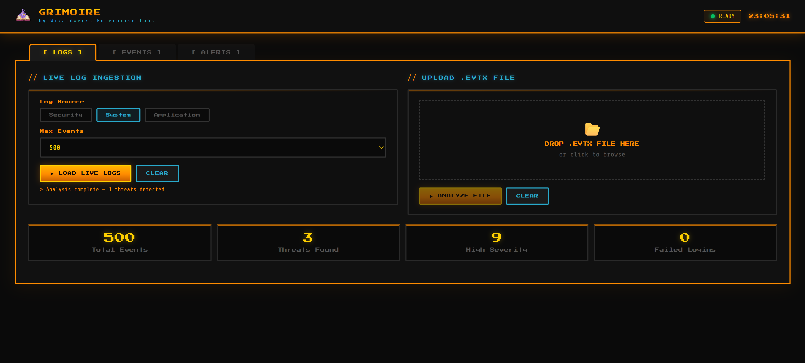
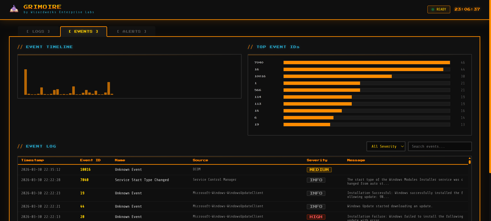
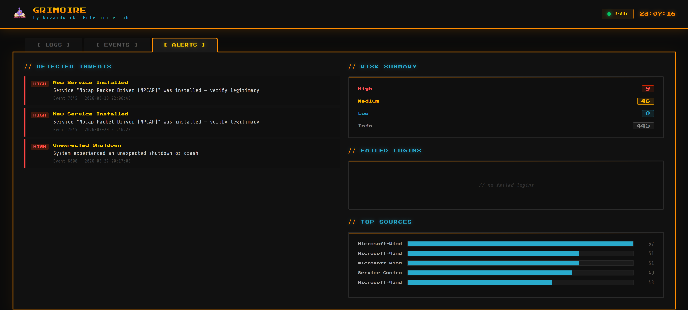

**By Wizardwerks Enterprise Labs**

---

Grimoire is a Windows Security Log analysis tool that ingests live Event Logs or uploaded `.evtx` files and surfaces threats, anomalies, and suspicious patterns in a unified web dashboard. Companion tool to [Spellcastr](https://github.com/JMitchTech/SPELLCASTR).


---

## Screenshots

### Logs

*Log ingestion controls — load live Windows Event Logs or upload an `.evtx` file for offline analysis.*

### Events

*Full filterable event table with timeline chart and top Event ID breakdown.*

### Alerts

*Detected threats ranked by severity, failed login leaderboard, and top alert sources.*

---

## Features

### Log Ingestion
- **Live mode** — reads directly from Windows Event Log (Security, System, Application)
- **Upload mode** — drag and drop any `.evtx` file for offline analysis
- Configurable max event count (100 to 1000)

### Threat Detection
- Brute force detection (repeated failed logins per account)
- Account lockout alerts
- New service installation flags
- Privilege escalation pattern detection
- Audit policy change detection
- Unexpected system shutdown alerts
- Audit log cleared detection (possible cover-up)
- Account creation, deletion, and group membership changes

### Dashboard
- **[ LOGS ]** — ingestion controls, live and upload modes, summary stats
- **[ EVENTS ]** — full filterable event table, timeline chart, top event ID breakdown
- **[ ALERTS ]** — detected threats ranked by severity, failed login leaderboard, top sources

---

## Tech Stack

| Layer      | Technology                      |
|------------|---------------------------------|
| Backend    | Python 3.10+, Flask 3.0         |
| Log Access | pywin32 (live logs)             |
| EVTX Parse | python-evtx (file mode)         |
| Frontend   | Vanilla HTML/CSS/JS             |
| Fonts      | Press Start 2P, Share Tech Mono |

---

## Installation
```bash
pip install -r requirements.txt

# pywin32 requires a post-install step on Windows:
python Scripts/pywin32_postinstall.py -install
```

## Running Grimoire

> ⚠️ Run as Administrator for live Windows Event Log access.
```cmd
python app.py
```

Open your browser to: **http://127.0.0.1:5001**

Note: Grimoire runs on port **5001** so it can run alongside Spellcastr (port 5000).

---

## Usage

### Live Log Analysis
1. Go to **[ LOGS ]** tab
2. Select log source: Security, System, or Application
3. Set max events
4. Click **▶ LOAD LIVE LOGS**
5. Review results in **[ EVENTS ]** and **[ ALERTS ]** tabs

### EVTX File Analysis
1. Export a log from Event Viewer: right click a log → **Save All Events As** → `.evtx`
2. Drag and drop the file into the upload zone in **[ LOGS ]**
3. Click **▶ ANALYZE FILE**

### Key Event IDs Monitored

| Event ID | Description           | Severity |
|----------|-----------------------|----------|
| 4625     | Failed Logon          | High     |
| 4740     | Account Locked Out    | High     |
| 4697     | Service Installed     | High     |
| 4719     | Audit Policy Changed  | High     |
| 6008     | Unexpected Shutdown   | High     |
| 4672     | Privilege Logon       | Medium   |
| 4720     | User Account Created  | Medium   |
| 4726     | User Account Deleted  | High     |
| 1102     | Audit Log Cleared     | High     |

---

## Project Structure
```
grimoire/
├── app.py                  # Flask application
├── requirements.txt
├── README.md
├── static/
│   ├── Grimoire_banner.png # Repo banner
│   ├── GRIMOIRE.png        # App logo
│   ├── css/
│   └── js/
├── templates/
│   └── index.html          # Single-page dashboard
├── uploads/                # Temporary .evtx upload storage
├── Screenshots/            # App screenshots
└── utils/
    ├── __init__.py
    ├── reader.py            # Live log + evtx file reader
    └── analyzer.py         # Threat detection and analysis engine
```

---

## Ethical & Legal Notice

This tool is intended for use on systems you own or have explicit permission to monitor. Always obtain proper authorization before analyzing logs on any system.

---

*Built by Wizardwerks Enterprise Labs*
*Companion to [Spellcastr](https://github.com/JMitchTech/SPELLCASTR)*